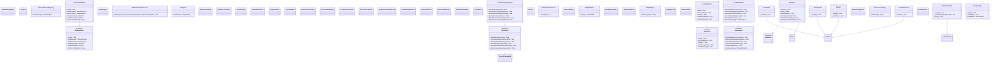

# meta

```mermaid
classDiagram
    class AdmiralShipEffect {
    }
    class Admiral {
    }
    class AdmiralEffectsRegistry {
        +ForAdmiral(id) IReadOnlyList<AdmiralShipEffect>
    }
    class AdmiralSelectUi {
        +_Ready() void
    }
    class BattleInputs {
    }
    class BattleOutcomeResolver {
        +Resolve(run, result, inputs, playerSnapshot, opponentSnapshot) Task<PostBattleTransition>
    }
    class Blueprint {
        +Instantiate() ShipDefData
    }
    class BlueprintCatalog {
    }
    class DockSessionInput {
    }
    class FleetShipRef {
    }
    class DockOffersResult {
    }
    class ShipTierOffer {
    }
    class ShipSlotOffer {
    }
    class ResearchTrackOffer {
    }
    class ResearchItemOffer {
    }
    class DockResourceState {
    }
    class DockActionResult {
    }
    class DockCommissionResult {
    }
    class DockSalvageResult {
    }
    class DockTierResult {
    }
    class DockTrackResult {
    }
    class DockSessionDelta {
    }
    class DockDelta {
    }
    class DockUi {
        +_Ready() void
        +_ExitTree() void
    }
    class Faction {
    }
    class HullClassExtensions {
        +Tonnage(h) int
    }
    class FleetJsonData {
    }
    class ShipDefData {
        +Clone() ShipDefData
    }
    class BoidWeightsData {
    }
    class WeaponDefData {
    }
    class ShipDisplay {
        +NameFor(ship) string
    }
    class IAdmiralStore {
        <<interface>>
        +Load() Task
        +GetAdmirals() IReadOnlyList<Admiral>
        +GetFactions() IReadOnlyList<Faction>
        +FindAdmiral(id) Admiral?
        +FindFaction(id) Faction?
        +NameFor(admiralId) string
    }
    class IDockyard {
        <<interface>>
        +GetOffersAsync(input) Task<DockOffersResult>
        +CommissionAsync(blueprintId) Task<DockCommissionResult>
        +SalvageFleetShipAsync(index) Task<DockSalvageResult>
        +RerollTierAsync(tierIndex) Task<DockTierResult>
        +RerollResearchAsync(trackIndex) Task<DockTrackResult>
        +BuyResearchAsync(upgradeId) Task<DockActionResult>
    }
    class IRunData {
        <<interface>>
    }
    class IRunStore {
        <<interface>>
        +Load() Task<RunSnapshot?>
        +Save(snapshot) Task
        +Delete() Task
        +StartRun(admiral) Task<RunSnapshot>
        +GetBattleSeed() Task<ulong>
    }
    class IStatsStore {
        <<interface>>
        +RecordBattle(record, inputs) Task
        +RecordSalvageSpent(amount) void
        +RecordTechSpent(amount) void
        +RecordCapitalShipBought() void
        +RecordRunVictory() void
        +GetJumpHistory() IReadOnlyList<JumpRecord>
    }
    class JumpRecord {
    }
    class LifetimeStats {
    }
    class LocalAdmiralStore {
        +Load() Task
        +GetAdmirals() IReadOnlyList<Admiral>
        +GetFactions() IReadOnlyList<Faction>
        +FindAdmiral(id) Admiral?
        +FindFaction(id) Faction?
        +NameFor(admiralId) string
    }
    class LocalDockyardAdapter {
        +GetOffersAsync(input) Task<DockOffersResult>
        +CommissionAsync(blueprintId) Task<DockCommissionResult>
        +SalvageFleetShipAsync(index) Task<DockSalvageResult>
        +RerollTierAsync(tierIndex) Task<DockTierResult>
        +RerollResearchAsync(trackIndex) Task<DockTrackResult>
        +BuyResearchAsync(upgradeId) Task<DockActionResult>
    }
    class LocalRunStore {
        +Load() Task<RunSnapshot?>
        +Save(snapshot) Task
        +Delete() Task
        +StartRun(admiral) Task<RunSnapshot>
        +GetBattleSeed() Task<ulong>
    }
    class LocalStatsStore {
        +RecordBattle(record, inputs) Task
        +RecordSalvageSpent(amount) void
        +RecordTechSpent(amount) void
        +RecordCapitalShipBought() void
        +RecordRunVictory() void
        +GetJumpHistory() IReadOnlyList<JumpRecord>
    }
    class MainMenuUi {
        +_Ready() void
    }
    class OptionsOverlay {
        +_Ready() void
        +_UnhandledInput(@event) void
        +Open() void
    }
    class ResearchUpgrade {
    }
    class ResearchCatalog {
        +LabelFor(id) string
    }
    class RunEndUi {
        +_Ready() void
    }
    class RunSnapshot {
    }
    class RunState {
        +_Ready() void
        +Save() Task
        +SaveSettings() void
        +StartRun(admiral) Task
        +AbandonCurrentRun() Task
        +GetOpponentFleetPath() string
    }
    class UserSettings {
        +Apply() void
        +Save(path) void
        +Load(path) UserSettings
    }
    AdmiralSelectUi --|> Control
    DockUi --|> Control
    IDockyard ..|> IAsyncDisposable
    LocalAdmiralStore ..|> IAdmiralStore
    LocalDockyardAdapter ..|> IDockyard
    LocalRunStore ..|> IRunStore
    LocalStatsStore ..|> IStatsStore
    MainMenuUi --|> Control
    OptionsOverlay --|> CanvasLayer
    RunEndUi --|> Control
    RunState --|> Node
    RunState ..|> IRunData
```
