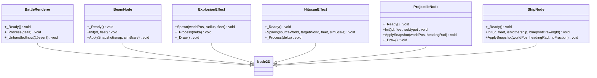

# rendering

```mermaid
classDiagram
    class BattleRenderer {
        +_Ready() void
        +_Process(delta) void
        +_UnhandledInput(@event) void
    }
    class BeamNode {
        +_Ready() void
        +Init(id, fleet) void
        +ApplySnapshot(snap, simScale) void
    }
    class ExplosionEffect {
        +Spawn(worldPos, radius, fleet) void
        +_Process(delta) void
        +_Draw() void
    }
    class HitscanEffect {
        +_Ready() void
        +Spawn(sourceWorld, targetWorld, fleet, simScale) void
        +_Process(delta) void
    }
    class ProjectileNode {
        +_Ready() void
        +Init(id, fleet, subtype) void
        +ApplySnapshot(worldPos, headingRad) void
        +_Draw() void
    }
    class ShipNode {
        +_Ready() void
        +Init(id, fleet, isMothership, blueprintDrawingId) void
        +ApplySnapshot(worldPos, headingRad, hpFraction) void
    }
    BattleRenderer --|> Node2D
    BeamNode --|> Node2D
    ExplosionEffect --|> Node2D
    HitscanEffect --|> Node2D
    ProjectileNode --|> Node2D
    ShipNode --|> Node2D
```
