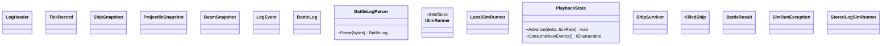

# sim

```mermaid
classDiagram
    class LogHeader {
    }
    class TickRecord {
    }
    class ShipSnapshot {
    }
    class ProjectileSnapshot {
    }
    class BeamSnapshot {
    }
    class LogEvent {
    }
    class BattleLog {
    }
    class BattleLogParser {
        +Parse(bytes) BattleLog
    }
    class ISimRunner {
        <<interface>>
    }
    class LocalSimRunner {
    }
    class PlaybackState {
        +Advance(delta, tickRate) void
        +ConsumeNewEvents() IEnumerable<LogEvent[]>
    }
    class ShipSurvivor {
    }
    class KilledShip {
    }
    class BattleResult {
    }
    class SimRunException {
    }
    class StoredLogSimRunner {
    }
```
